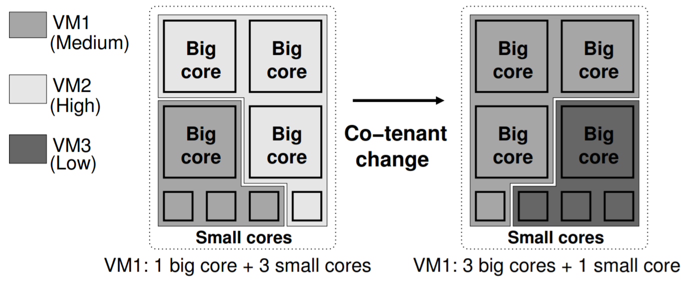

# Fairness-oriented Scheduler for Asymmetric Multicores

by Changdae Kim (cdkim@calab.kaist.ac.kr)

## Overview
Schedule cores in a multicore environment.


## How to install
1. Download Linux kernel 3.7.3 and patch linux-3.7.3-fairamp.patch.
2. Compile and install the patched kernel on the system.
   Note that the following options must be enabled to use fairness-oriented scheduler.
   * General setup -> Fairness-oriented scheduling for asymmetric multi-cores (FAIRAMP)
   * General setup -> FAIRAMP really DO the scheduling
   * General setup -> FAIRAMP use fast-core-first policy
   * General setup -> FAIRAMP measures instruction per seconds
3. Go to tools/fairamp in the patched kernel source tree.
4. Install the tool to using fairness-oriented scheduler.
    ```
    $ make
    $ sudo make install
    ```

## How to run
1. Run the following command and refer to the usage
    ```  
    $ fairamp -h
    ```   
2. Sample run command is here.
    ```
    $ fairamp -c test.comm
    ``` 
   (test.comm is included in tools/fairamp/)
   
3. If you want to see less messages, use the follow command. The other options are same with fairamp.
    ```
    $ fairamp.quiet -c test.comm
    ```

## NOTE
1. This software works on x86_64 architecture, that is, 64-bit processors from Intel or AMD.
2. This version is tested and validated using Ubuntu 12.04.5 and gcc 4.6.3. 
   Some problem may occurs on other environments.
3. DVFS should be available for the system.
4. CPU hotplug is enabled OR all cores should be turned on.
5. Detecting hard lockups must be disabled due to confliction on using performance counters.
   You should clear the following kernel option: Kernel hacking -> Kernel debugging -> Detect Hard and Soft Lockups
   

#### For more information, please refer to our paper,

Changdae Kim and Jaehyuk Huh. Exploring the Design Space of Fair Scheduling Supports for Asymmetric Multicore Systems. IEEE Transactions on Computers, vol. 67, no. 8, pp. 1136-1152, August 2018.

https://ieeexplore.ieee.org/document/8265024
 
## Future Works
1. Testing the test script to work on the original environment.
1. Merge and update the software to work on lastest versions. (Targeting Ubuntu 18.04 and Linux 5.4)
